# Superligaen Analytics

An end-to-end data engineering project tracking the Danish premier football league (Superligaen) — from raw API ingestion to a live analytics dashboard.

**Live dashboard →** [superligaanalytics.vercel.app](https://superligaanalytics.vercel.app/)

---

## Architecture

```
Sportmonks API
       │
       ▼
  Bronze layer        Raw JSON stored in MotherDuck (one table per endpoint)
       │
       ▼
  Silver layer        Cleaned, typed, structured relational tables  (dbt)
       │
       ▼
  Gold layer          Kimball star schema  ─────────────────────────────┐
                      (dims + fct_team_matches                          │
                           + fct_player_appearances)  (dbt)             │
                                                                        ▼
                                                             Evidence.dev dashboard
                                                             deployed on Vercel
```

The nightly GitHub Actions pipeline runs all three layers sequentially, then triggers a Vercel rebuild so the dashboard always reflects last night's data.

---

## Tech stack

| Layer | Tool |
|---|---|
| Data source | Sportmonks REST API |
| Data warehouse | MotherDuck (DuckDB cloud) |
| Ingestion | Python (`ingestion/sportmonks/`) |
| Transformations | dbt-duckdb (`dbt/`) |
| Orchestration | GitHub Actions (nightly + manual triggers) |
| BI / Dashboard | Evidence.dev |
| Hosting | Vercel |

---

## Data model

The gold layer follows **Kimball dimensional modelling**. Main fact grain: **one row per team per match** (`fct_team_matches` — each fixture produces two rows, one for each side). A second fact table `fct_player_appearances` holds individual player stats at match level.

```mermaid
erDiagram
    fct_team_matches {
        int match_sk FK
        int date_sk FK
        int time_sk FK
        int team_sk FK
        int opponent_team_sk FK
        int league_sk FK
        int stadium_sk FK
        int referee_sk FK
        int team_side_sk FK
        int match_result_sk FK
        int goals_scored
        int goals_conceded
        int goals_ht_scored
        int goals_ht_conceded
        decimal ball_possession_pct
        int corner_kicks
        int yellow_cards
        int red_cards
        int saves
        int fouls
        int offsides
        int points_earned
    }

    fct_player_appearances {
        int match_sk FK
        int player_sk FK
        int team_sk FK
        int position_sk FK
        int appearance_type_sk FK
        int shots_on_target
        int shots_off_target
        int shots_total
        int shots_blocked
        int passes_total
        int passes_accurate
        int fouls_committed
        int saves
        int offsides
        int minutes_played
    }

    dim_date {
        int date_sk PK
        date date
        int year
        int month
        varchar month_name
        int quarter
        int week_number
        int day_of_week
        varchar day_name
        boolean is_weekend
        varchar season
        boolean is_current_season
    }

    dim_time {
        int time_sk PK
        int hour
        int minute
        varchar period_of_day
    }

    dim_team {
        int team_sk PK
        int team_id
        varchar team_name
        varchar team_code
        varchar team_short_name
        varchar team_country
        int team_founded_year
        varchar team_logo
        varchar team_venue_name
        varchar team_venue_city
        int team_venue_capacity
    }

    dim_opponent_team {
        int opponent_team_sk PK
        int opponent_team_id
        varchar opponent_team_name
        varchar opponent_team_code
        varchar opponent_team_short_name
        varchar opponent_team_country
        varchar opponent_team_logo
    }

    dim_match {
        int match_sk PK
        int match_id
        varchar match_round_type
        varchar match_round_name
        int match_round_number
        varchar match_name
        varchar match_short_name
        varchar match_type
        varchar match_status
        varchar match_result
        varchar kick_off_time
    }

    dim_league {
        int league_sk PK
        int league_id
        varchar league_name
        varchar league_type
        varchar league_country
        varchar league_country_code
        varchar league_logo
        varchar league_country_flag
    }

    dim_stadium {
        int stadium_sk PK
        int stadium_id
        varchar stadium_name
        varchar stadium_city
        varchar stadium_country
        varchar stadium_address
        varchar stadium_surface
        int stadium_capacity
    }

    dim_referee {
        int referee_sk PK
        int referee_id
        varchar referee_common_name
        varchar referee_firstname
        varchar referee_lastname
        varchar referee_display_name
        varchar referee_nationality
    }

    dim_player {
        int player_sk PK
        int player_id
        varchar player_name
        varchar player_nationality
        date player_birth_date
        varchar player_position
        varchar player_detailed_position
        int player_height
        int player_weight
    }

    dim_position {
        int position_sk PK
        varchar position_name
        varchar position_short_code
        varchar position_group
    }

    dim_coach {
        int coach_sk PK
        int coach_id
        varchar coach_display_name
        varchar coach_nationality
    }

    dim_team_side {
        int team_side_sk PK
        varchar team_side
    }

    dim_match_result {
        int match_result_sk PK
        varchar match_result
    }

    fct_team_matches }o--|| dim_date : "date_sk"
    fct_team_matches }o--|| dim_time : "time_sk"
    fct_team_matches }o--|| dim_team : "team_sk"
    fct_team_matches }o--|| dim_opponent_team : "opponent_team_sk"
    fct_team_matches }o--|| dim_match : "match_sk"
    fct_team_matches }o--|| dim_league : "league_sk"
    fct_team_matches }o--|| dim_stadium : "stadium_sk"
    fct_team_matches }o--|| dim_referee : "referee_sk"
    fct_team_matches }o--|| dim_team_side : "team_side_sk"
    fct_team_matches }o--|| dim_match_result : "match_result_sk"
    fct_player_appearances }o--|| dim_match : "match_sk"
    fct_player_appearances }o--|| dim_player : "player_sk"
    fct_player_appearances }o--|| dim_team : "team_sk"
    fct_player_appearances }o--|| dim_position : "position_sk"
```



All dimension surrogate keys are **stable across runs** — new records get new SKs, existing records keep theirs. Sentinel rows (`-1 Unknown`, `-2 Not Applicable`) handle missing lookups, with all VARCHAR attributes filled with descriptive defaults (e.g. `'Unknown Stadium Country'`).

---

## Dashboard pages

| Page | Description |
|---|---|
| **Home** | Season KPIs, current leader, navigation |
| **Standings** | Championship, Relegation & Regular Season tables |
| **Match Results** | Full match history, scorelines and analytics by round |
| **Upcoming Fixtures** | Next fixtures with head-to-head history and last-5 form guide |
| **League Analytics** | Cross-team benchmarks, rankings and league-wide trends |
| **Team Analytics** | Deep-dive per-team KPIs, form, shooting, possession, discipline |
| **Referee Analytics** | Cards, fouls, team exposure and match logs by referee |
| **Glossary** | Definitions of all metrics and KPIs used across the dashboard |

---

## Project structure

```
.
├── ingestion/
│   └── sportmonks/             # Bronze: pull from Sportmonks API → MotherDuck
│       ├── run.py              # Ingestion runner (incremental + full load)
│       ├── engine.py           # Metadata-driven fetch engine
│       ├── api.py              # Sportmonks API client
│       ├── db.py               # MotherDuck connection
│       └── config.py           # Endpoint manifest + env vars
│
├── dbt/                        # Silver + Gold transformations (dbt-duckdb)
│   ├── models/
│   │   ├── silver/             # 37 models: bronze JSON → structured tables
│   │   └── gold/
│   │       ├── dims/           # 15 dim_* models (Kimball dims)
│   │       ├── fct_team_matches.sql
│   │       └── fct_player_appearances.sql
│   ├── seeds/                  # team_names.csv (display names + codes)
│   ├── tests/                  # Custom SQL DQ assertions
│   ├── macros/
│   └── dbt_project.yml
│
├── dashboards/                 # Evidence.dev BI app
│   ├── pages/                  # One .md file per dashboard page
│   └── sources/superligaen/    # SQL sources queried at build time
│
├── scripts/
│   ├── push_to_prod.py         # Push local DuckDB → MotherDuck (schema-selective)
│   └── pull_from_prod.py       # Pull MotherDuck → local DuckDB
│
├── .github/workflows/
│   ├── master.yml              # Nightly: bronze → silver → gold → DQ → deploy
│   ├── ci.yml                  # PR validation: Python syntax + dbt compile
│   ├── bronze.yml              # Manual bronze-only run
│   ├── silver.yml              # Manual silver-only run (dbt)
│   ├── gold.yml                # Manual gold-only run (dbt)
│   ├── dq.yml                  # Manual DQ test run
│   └── vercel.yml              # Manual Vercel deploy trigger
│
└── requirements.txt
```

---

## Environments

| Environment | MotherDuck database | dbt target | Triggered by |
|---|---|---|---|
| Dev | `superligaen_dev` (local DuckDB) | `dev` | Local / feature branches |
| Prod | `superligaen` | `prod` | GitHub Actions (`main`) |

Dev runs against a local `superligaen_dev.duckdb` file. Use `scripts/push_to_prod.py` to push local data to MotherDuck dev for dashboard testing.

---

## Local setup

```bash
# 1. Clone and create a feature branch
git clone https://github.com/SaUgKi1773/data-engineering-demo.git
git checkout -b dev/<your-feature>

# 2. Create virtual environment
python3.11 -m venv .venv
source .venv/bin/activate
pip install -r requirements.txt

# 3. Configure environment
cp .env.example .env
# Fill in MOTHERDUCK_TOKEN and SPORTMONKS_API_KEY

# 4. Run layers against local dev
python ingestion/sportmonks/run.py
cd dbt
dbt seed --target dev
dbt run --select silver.* --target dev
dbt run --select gold.* --target dev

# 5. Push to MotherDuck dev for dashboard testing
cd ..
python scripts/push_to_prod.py --db superligaen_dev --schema silver gold

# 6. Run the dashboard locally
cd dashboards
npm install
npm run sources   # regenerates parquet cache from MotherDuck
npm run dev
# → http://localhost:3000
```

---

## GitHub Actions secrets

| Secret | Description |
|---|---|
| `MOTHERDUCK_TOKEN` | MotherDuck service token (read-write) |
| `MOTHERDUCK_TOKEN_READONLY` | MotherDuck read-only token (dashboard build) |
| `SPORTMONKS_API_KEY` | Sportmonks API key |
